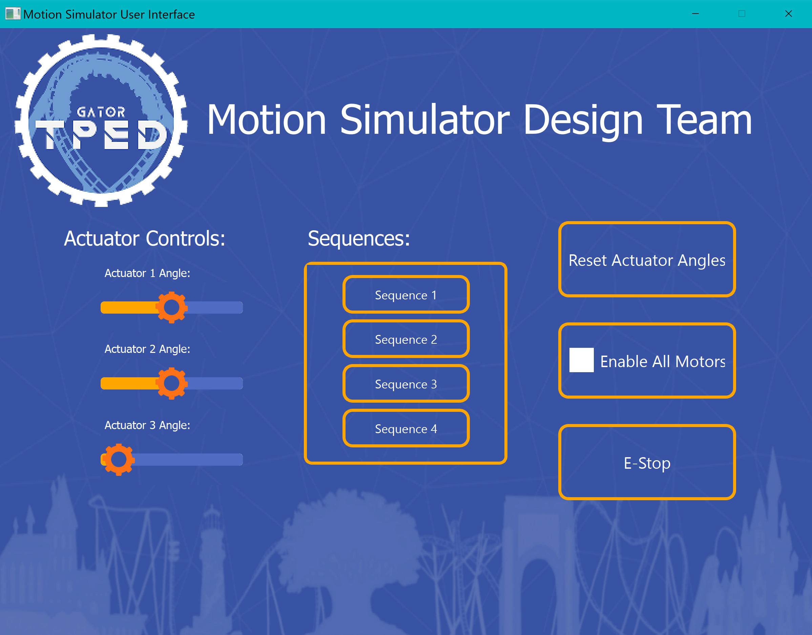

# Project Description
This python project is an automation tool to control some hardware with your computer. It uses the `PySide6` library for a graphical user interface (GUI) and the `serial` library to communicate with an Arduino controller which manages the hardware. The CSV file containing required details is read using `Pandas`, a powerful library for data analysis in Python.
## Module Descriptions
The project is split into three different files:
1. **widget.py**: This file is the main application, it creates a GUI using PySide6 which allows user to interact with the application. The GUI comprises of elements including buttons, checkboxes, sliders etc. It leverages `ArdiunoTalk` and `saveFileAsArr` classes to communicate with Arduino and manipulate data respectively. It also includes keyboard event to trigger function via key press.
2. **talkToArduino.py**: This file includes class `ArdiunoTalk` which establishes communication with Arduino and sends angles by writing to serial. It also includes functionality to enable/disable the Arduino operation.
3. **readCSV.py**: This file contains a function to read a CSV file and return its contents as a list of tuples. It uses pandas library to accomplish this.

## Setup & Usage
You can run the project simply by running the `widget.py` file in a python environment that has the `PySide6`, `Pandas`, and `serial` libraries installed. This opens a graphical user interface which can be used to interact with the connected Arduino.
This application assumes that the Arduino is connected to the computer and there exists a CSV file named `test.csv` in the same directory containing the required information in the format needed.
## Functionality
Once enabled by checking the `Enable All` checkbox on the UI, you can then interact with:
- Home button to set all angles to 0.
- The three dials to manually adjust angles.
- A list of predefined named buttons that represent specific sequences of angles, which are read from a CSV file.
- An `E-Stop` button can be used to discontinue execution of any ongoing command.

This is a very flexible codebase and can be edited according to your individual needs. For further queries & understanding about the code, kindly delve into the files.